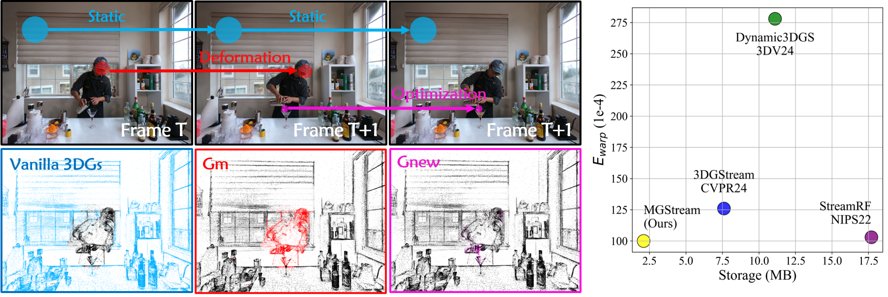

<h1>MGStream: Motion-aware 3D Gaussian for Streamable Dynamic Scene Reconstruction </h1>

    Zhenyu Bao1&emsp;
    Qing Li2, *&emsp;
    Guibiao Liao1, *&emsp;
    Zhongyuan Zhao1&emsp;
    Kanglin Liu2

    1Peking University&emsp;
    2Pengcheng Laboratory

    *corresponding author

### [Paper]() | [Project]() | Video | Code ( is coming soon... )

 

# Abstract

    3D Gaussian Splatting (3DGS) has gained significant attention in streamable dynamic novel view synthesis (DNVS) for its photorealistic rendering capability and computational efficiency. Despite much progress in improving rendering quality and optimization strategies, 3DGS-based streamable dynamic scene reconstruction still suffers from flickering artifacts and storage inefficiency, and struggles to model the emerging objects. To tackle this, we introduce MGStream which employs the motion-related 3D Gaussians (3DGs) to reconstruct the dynamic and the vanilla 3DGs for the static. The motion-related 3DGs are implemented according to the motion mask and the clustering-based convex hull algorithm. The rigid deformation is applied to the motion-related 3DGs for modeling the dynamic, and the attention-based optimization on the motion-related 3DGs enables the reconstruction of the emerging objects. As the deformation and optimization are only conducted on the motion-related 3DGs, MGStream avoids flickering artifacts and improves the storage efficiency. Extensive experiments on real-world datasets N3DV and MeetRoom demonstrate that MGStream surpasses existing streaming 3DGS-based approaches in terms of rendering quality, training/storage efficiency and temporal consistency.

